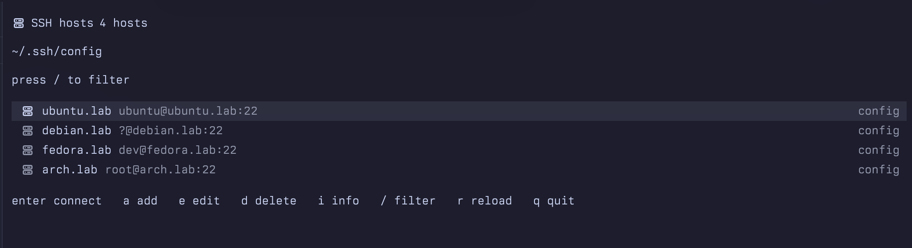

# tern-ssh

An ssh host manager that runs as a [Tern](https://stencil.so/tern) pane. It
lists the hosts of an ssh config, connects to them, and adds, edits and
removes hosts without leaving Tern.

Inside Tern the list, the host details and the add/edit form are native
elements drawn through the Tern Surface Protocol (with the
[Go SDK](https://github.com/stencil-hq/tern-sdk/tree/main/go/tern)); in any
other terminal the same program prints the hosts as plain text.



The details card shows on `i`; the list is what opens by default.

## Install

```sh
tern plugin install github.com/aancw/tern-ssh
```

If you want to clone the repo or manually install using go:
```sh

# clone the repo
git clone github.com/aancw/tern-ssh
make build           # bin/tern-ssh
make plugin-link     # use this checkout as the plugin, then: tern plugin reload
make plugin-install  # install a copy of it (--force to replace one)

# install via go install
go install github.com/aancw/tern-ssh@latest          

# reload the tern plugin                          
tern plugin reload
```

`tern plugin list` should show `ternssh … window ready`. A plugin listed as
`disabled` is named in `plugins_disabled` in Tern's `settings.json`; remove it
there or toggle it in Preferences → Plugins.

## Palette rows and chords

Two rows, in the **SSH** palette group, one per placement, because a plugin
command cannot see which chord ran it, so the placement cannot be a modifier of
one row:

| Row | Action id | What it does | Default chord |
| --- | --- | --- | --- |
| SSH hosts | `plugin.ternssh.open` | opens the manager in a new tab | none |
| SSH hosts split | `plugin.ternssh.split` | opens it in a split of the focused pane | `cmd+shift+h` |

One chord runs one action, so only `split` carries a default. Bind what you use
in `settings.json`; a chord Tern's own keymap already takes is dropped with a
`plugin bind left out` warning in the log:

```json
{ "keybinds": {
	"cmd+shift+h": "plugin.ternssh.split",
	"cmd+alt+shift+t": "plugin.ternssh.open"
} }
```

A clicked `ssh://user@host:port` link opens a session for that host in a split
of the pane it was clicked in.

## Keys

| Key | What it does |
| --- | --- |
| `enter` | connect in this pane; the manager returns when ssh ends |
| `a` | add a host |
| `e` | edit the selected host |
| `d` | remove the selected host (with a `y`/`n` prompt) |
| `i` | show or hide the selected host's details |
| `/` | filter the list; `esc` clears |
| `j` `k` `g` `G` | move the cursor |
| `r` | read the config file again |
| `q` | quit |

A host whose block sets no `User` asks which login name to use before it
connects. The name is passed to ssh with `-l`; leaving the prompt empty logs
in as the local user, which is what ssh does with no `User` at all.

In the form: `tab` and `shift+tab` move between fields, `enter` saves, `esc`
cancels, `ctrl+u` clears the field.

## The config file

`$TERN_SSH_CONFIG`, or `~/.ssh/config` with `--config PATH`. A missing file is
fine: the first host you add creates it.

Writes are surgical. Adding appends one block; editing rewrites only the lines
of that block, keeping its comments and the directives the form does not manage
(`ProxyCommand`, forwarding, and so on); removing drops that block alone.
Nothing else in the file changes, and the file keeps its permissions.

Editing the alias rewrites the block's `Host` line, so a host can be renamed.
A name already in the file is refused, and the form says so.

Blocks the manager writes carry a `# tern-ssh` marker above them.

## How it talks to Tern

- Connections run `tern ssh <alias>`, Tern's own ssh, so a host that lacks
  Tern's terminfo entry still gets a working terminal. With a `--config` other
  than ssh's default, `-F <file>` is passed too, so the alias resolves the way
  the manager shows it.
- `enter` gives this pane to ssh: the protocol session is closed first (which
  restores the terminal and stops the input reader, so no keystrokes are
  stolen) and the pane is handed over with `exec`. When ssh ends, the pane runs
  the manager again, so it comes back.
- That session runs in the manager's own pane, never in another one: a pane
  cannot reliably open a block beside itself, because `tern split` resolves the
  window from `TERN_WINDOW_KEY` and Tern does not always set it. To keep the
  manager on screen while a session runs, open the session from another pane,
  or run `tern split` yourself.

## TODO

- **Connect in a block beside the manager, or in a new tab.** Parked as
  `park:` comments in `internal/app/app.go` (the `s` and `t` keys) and
  `internal/app/connect.go` (`spawn`). Blocked because a pane cannot say which
  window it belongs to: `tern split` reads `TERN_WINDOW_KEY`, Tern does not
  always set it in a pane, so the CLI falls back to the first window and the
  block can land next to another window's pane. Uncommenting the two blocks is
  not enough; the fix has to find the window reliably first, either from a
  value the pane can read or by letting the plugin's window half open the block
  from a request the manager leaves behind.

## Limits

- Only the file itself is read. `Include` directives are not followed, and
  `Match` blocks are left alone.
- Blocks whose patterns are not literal (`Host *`, `Host *.example.com`) are
  not listed. Their options still show up as the resolved values of the hosts
  they apply to.
- `Port`, `HostName`, `User` and `IdentityFile` values are shown as written;
  `%h`-style tokens and a leading `~` in `IdentityFile` are not expanded.
- The form manages `HostName`, `User`, `Port`, `IdentityFile` and `ProxyJump`;
  an alias keeps one `Host` line.

## Layout

| Path | Holds |
| --- | --- |
| `main.go` | the command line: the manager, and `list`, `add`, `edit`, `remove`, `connect` |
| `internal/sshconf` | reading, resolving and editing the ssh config |
| `internal/app` | the Tern pane: state, keys, views, plain-text fallback |
| `plugin.toml`, `window.luau` | the Tern plugin package; it sits at the root, so the repository is the package |

## Development

```sh
make build           # bin/tern-ssh
make test            # the sshconf tests
make plugin-link     # use this checkout as the plugin, then: tern plugin reload
make plugin-install  # install a copy of it (--force to replace one)
```

[LICENSE](LICENSE): MIT.
